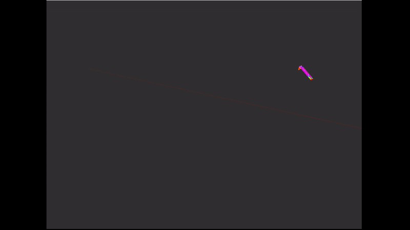

# dynamic_mesh

Subscribed topics:
- input_cloud (sensor_msgs/PointCloud2): The pointcloud from which the mesh will be made

Published topics:
- output_mesh (sensor_msgs/PointCloud2): The output mesh constructed from the pointcloud

Parameters:
- pcl_frequency (int): The **expected** frequency at which the input_cloud topic is coming
- decay (int): The number of seconds to keep buffering the pointcloud  

## example usage
```bash
ros2 run dynamic_mesh pcl_buffer_node --ros-args -r input_cloud:=/transformed_pointcloud -r output_mesh:=/cloud_mesh
```

